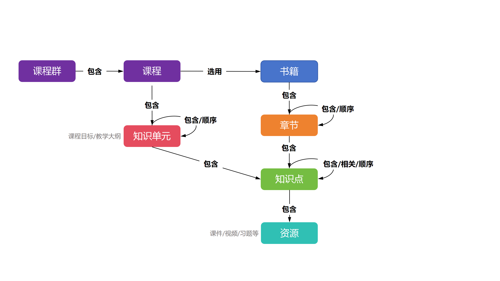

<p align="center">

</p>

<div align="center">
<h1>
  CourseKG: 使用大模型自动构建课程知识图谱
</h1>
</div>

<h4 align="center">
    <p>
        <b>中文</b> | <a href="README_en.md">English</a>
    </p>
</h4>

CourseKG 使用大模型，利用多种 prompt 优化技术, 自动从教材、书籍中抽取知识点, 构成以课程-章节-知识点为主题的知识图谱。为增加每个知识点的信息, CourseKG 可以为知识点链接相应的习题、扩展阅读材料等资源, 另外也可利用多模态大模型从 ppx、图片、视频中提取信息并与之相关联。

基本框架如下图所示：

<p align="center">

<p align="center">

#### 局限性：

- 目前只实现了基本的知识图谱抽取和对 pptx 的解析，效果有待优化
- 对视频的解析还处于规划中

#### 未来发展方向：

- 改进提示词工程，并尝试使用 Agent 完成相关工作
- 基于图谱的问答 ( KBQA 或 Graph-RAG )

## 快速使用

直接 clone 本仓库并安装相应依赖, cuda 版本建议: 12.2

```bash
git clone git@github.com:wangtao2001/CourseKG.git
cd CourseKG
conda create -n kg python=3.10
conda activate kg
pip install -r requirements.txt
pip install -e .
```

> 其中 windows 下安装 faiss-gpu 请使用命令: `conda install conda-forge::faiss-gpu==1.7.2`

> linux 下还需安装 libreoffice 以完成文档转换，以 Debian 系为例执行安装: `sudo apt install libreoffice`

然后执行 `examples` 目录下的示例文件

## 文档

你可以访问 [在线文档](https://wangtao2001.github.io/CourseKG/) (由于项目功能仍处于快速开发中，故在线文档暂时还没有准备好)。如果你希望自定义文档请依照以下步骤：

#### 依赖安装和预览

文档使用 [VitePress](https://vitepress.dev/) 构建, 需安装 Node.js 18 及以上版本

```bash
npm i
npm run docs:dev
```

浏览器打开 [http://localhost:5173/](http://localhost:5173/) 即可进行预览

#### 部署

文档修改和部署请参考 [VitePress文档](https://vitepress.dev/guide/what-is-vitepress/)

## 贡献和引用

欢迎提交 `<a href="https://github.com/wangtao2001/CourseKG/pulls">`PR`</a>` 或 `<a href="https://github.com/wangtao2001/CourseKG/issues">`Issues`</a>`，也欢迎参与任何形式的贡献

如果觉得 CourseKG 项目有助于您的工作，请考虑如下引用:

```
 @misc{CourseKG,
       author = {Wang, Tao},
       year = {2024},
       note = {https://github.com/wangtao2001/CourseKG},
       title = {CourseKG: Automatic Construction of Course Knowledge Graphs Using Large Models}
    }
```
